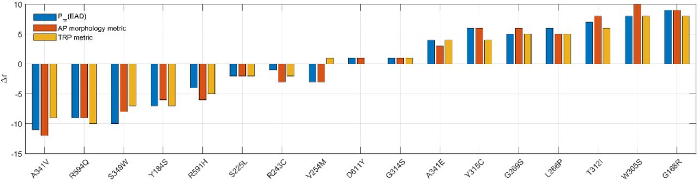

 

# Author summary

An early after-depolarization (EAD) is an abnormal cellular electrical event which can trigger dangerous arrhythmias in the heart. We use our previously developed method to build a simple logistic regression model (LRM) that estimates the probability of EAD (P(EAD)) as a function of myocyte model parameters. Using this LRM along with two other recently published model-based arrhythmia risk predictors, we estimate risk of arrhythmia for 17 Long QT syndrome type 1 (LQTS1) mutations. Results show that all approaches have similar prediction performance in that there are a set of mutations whose relative clinical risk for arrhythmia are well estimated using these metrics, but that relative risk is consistently over- or under-estimated across all approaches for a significant number of other mutations. We believe this indicates that the functional characterization of the LQTS1 phenotype is incomplete.

[Read paper here](https://www.biorxiv.org/content/10.1101/2020.04.09.034843v2)