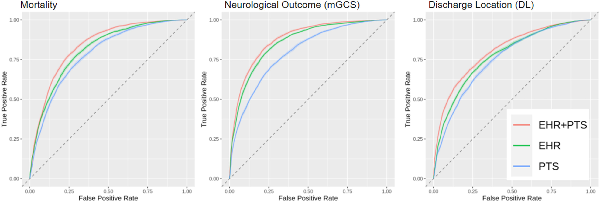

 

# Author summary
Background
There is an unmet need for timely and reliable prediction of post-cardiac arrest (CA) clinical trajectories. We hypothesized that physiological time series (PTS) data recorded on the first day of intensive care would contribute significantly to discrimination of outcomes at discharge.

Patients and methods
Adult patients in the multicenter eICU database who were mechanically ventilated after resuscitation from out-of-hospital CA were included. Outcomes of interest were survival, neurological status based on Glasgow motor subscore (mGCS) and surrogate functional status based on discharge location (DL), at hospital discharge. Three machine learning predictive models were trained, one with features from the electronic health records (EHR), the second using features derived from PTS collected in the first 24 h after ICU admission (PTS24), and the third combining PTS24 and EHR. Model performances were compared, and the best performing model was externally validated in the MIMIC-III dataset.

Results
Data from 2216 admissions were included in the analysis. Discrimination of prediction models combining EHR and PTS24 features was higher than models using either EHR or PTS24 for prediction of survival (AUROC 0.83, 0.82 and 0.79 respectively), neurological outcome (0.87, 0.86 and 0.79 respectively), and DL (0.80, 0.78 and 0.76 respectively). External validation in MIMIC-III (n = 86) produced similar model performance. Feature analysis suggested prognostic significance of previously unknown EHR and PTS24 variables.

Conclusion
These results indicate that physiological data recorded in the early phase after CA resuscitation contain signatures that are linked to post-CA outcome. Additionally, they attest to the effectiveness of ML for post-CA predictive modeling.

[Read paper here](https://www.sciencedirect.com/science/article/pii/S2352556821002228?casa_token=YjKVTtgva6sAAAAA:TosWExiXl7niXhgeff3VHpyoXL9p-bY9vXw_IOe_w__Cb0Yqrlz2798ZdEV_KMI3Y3y4xNuh)

<!-- [Download paper here](http://academicpages.github.io/files/paper1.pdf)

Recommended citation: Your Name, You. (2009). "Paper Title Number 1." <i>Journal 1</i>. 1(1). -->